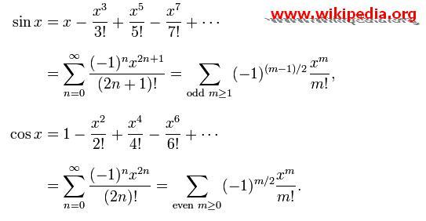



## How do the Sine and Cosine work???

### Description

You can draw ellipses without using the sin() and cos() functions, by using these functions, you will understand how do the sine and the cosine works
 
### More Info
 

             |
---                |---
**Submitted On**   |2009-07-09 11:00:02
**By**             |[Saed abumokh](https://github.com/Planet-Source-Code/PSCIndex/blob/master/ByAuthor/saed-abumokh.md)
**Level**          |Intermediate
**User Rating**    |5.0 (10 globes from 2 users)
**Compatibility**  |VB 6\.0
**Category**       |[Math/ Dates](https://github.com/Planet-Source-Code/PSCIndex/blob/master/ByCategory/math-dates__1-37.md)
**World**          |[Visual Basic](https://github.com/Planet-Source-Code/PSCIndex/blob/master/ByWorld/visual-basic.md)
**Archive File**   |[How\_do\_the215708792009\.zip](https://github.com/Planet-Source-Code/saed-abumokh-how-do-the-sine-and-cosine-work__1-72243/archive/master.zip)

